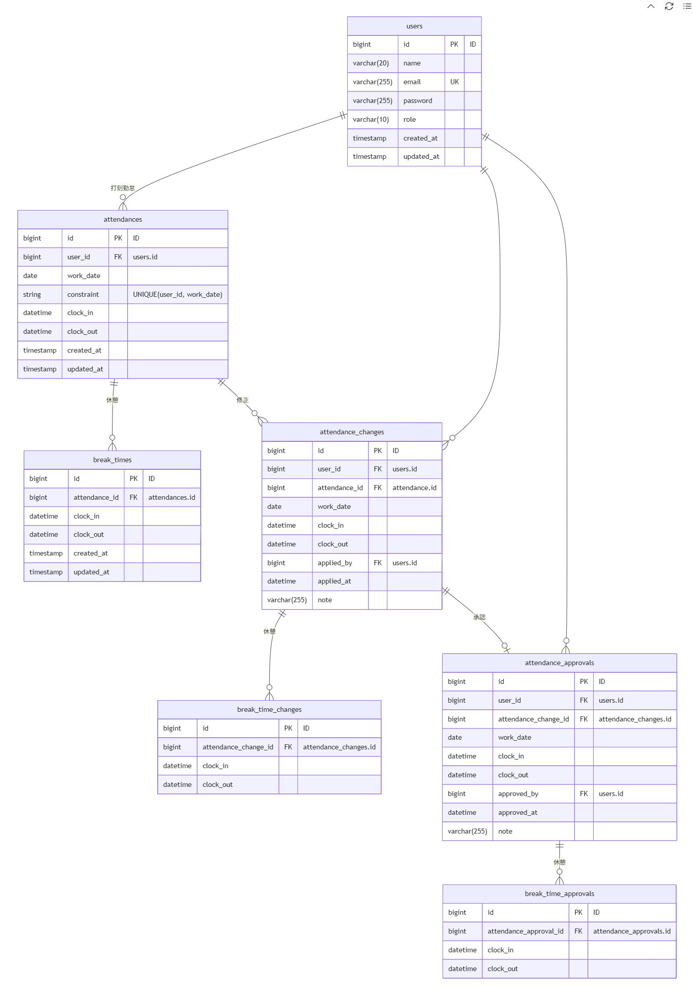

# 勤怠管理アプリ

### 主な機能

**一般会員**
* ユーザー登録・ログイン機能(メール認証付き)
* 勤怠打刻機能
* 勤怠詳細表示
* 勤怠修正機能（修正申請機能付き）
* 勤怠一覧表示（月毎）
* 申請勤怠一覧表示（承認待ち・承認済み）

**管理者**
* ログイン機能
* 勤怠一覧表示（日/ユーザー毎）
* 勤怠詳細表示
* 勤怠修正機能
* 申請勤怠一覧表示（承認待ち・承認済み）
* 修正勤怠承認機能

**外部サービス**
* 本アプリでは以下を使用しています<br>
⚠️利用するために、各自でアカウント作成およびセットアップを行ってください
*  [Mailtrap（メール認証）](https://mailtrap.io/signin)

**設定方法**
* .env、.env.testingファイルに環境変数を設定してください。
* 詳細は各公式ドキュメントを参照してください。

## 環境構築
**Dockerビルド**
1. `git clone git@github.com:nozomishibutani/worklog-project.git`
2. DockerDesktopアプリを立ち上げる
3. プロジェクトのルートディレクトリ（docker-compose.yml がある場所）に移動
4. `docker-compose up -d --build`

**Laravel環境構築**
1. `docker-compose exec php bash`
2. `composer install`
3. 「.env.example」ファイルを 「.env」ファイルに命名を変更。または、新しく.envファイルを作成
4. .envに以下の環境変数を追加
``` text
DB_CONNECTION=mysql
DB_HOST=mysql
DB_PORT=3306
DB_DATABASE=laravel_db
DB_USERNAME=laravel_user
DB_PASSWORD=laravel_pass

# Mailtrap（メール認証）
MAIL_MAILER=smtp
MAIL_SCHEME=null
MAIL_HOST=sandbox.smtp.mailtrap.io
MAIL_PORT=2525
MAIL_USERNAME=xxxx
MAIL_PASSWORD=xxxx
MAIL_FROM_ADDRESS=test@example.com # 値は自由です
MAIL_FROM_NAME="Test App" # 値は自由です

# 下記をコメントアウトまたは削除
# APP_LOCALE=en
# APP_FALLBACK_LOCALE=en
# APP_FAKER_LOCALE=en_US
```

5. アプリケーションキーの作成
``` bash
php artisan key:generate
```
6. マイグレーションの実行
``` bash
php artisan migrate
```
7. シーディングの実行
``` bash
php artisan db:seed
```

**Laravel PHPUnitテスト 環境構築**

1. テスト用データベースの作成
``` text
docker-compose exec mysql bash
mysql -u root -p
```
- パスワードは docker-compose.yml の MYSQL_ROOT_PASSWORD に設定されている値を使用してください。
- デフォルトでは root が設定されています

``` text
CREATE DATABASE demo_test;
```
2. 「.env.example」ファイルを 「.env.testing」ファイルに命名を変更。または、新しく.env.testingファイルを作成
``` text
APP_ENV=test

DB_CONNECTION=mysql
DB_HOST=mysql
DB_PORT=3306
DB_DATABASE=demo_test
DB_USERNAME=root
DB_PASSWORD=root

# Mailtrap（メール認証）
MAIL_MAILER=smtp
MAIL_SCHEME=null
MAIL_HOST=sandbox.smtp.mailtrap.io
MAIL_PORT=2525
MAIL_USERNAME=xxxx
MAIL_PASSWORD=xxxx
MAIL_FROM_ADDRESS=test@example.com # 値は自由です
MAIL_FROM_NAME="Test App" # 値は自由です

# 下記をコメントアウトまたは削除
# APP_LOCALE=en
# APP_FALLBACK_LOCALE=en
# APP_FAKER_LOCALE=en_US
```
3. アプリケーションキーの作成
``` bash
php artisan key:generate --env=testing
```

## ⚠️ 注意事項
### 権限エラーについて（Windows環境）
Windows + Docker 環境では、以下のような権限エラーが発生する場合があります。
> tempnam(): file created in the system's temporary directory
> The stream or file "/var/www/storage/logs/laravel.log" could not be opened in append mode: Failed to open stream: Permission denied The exception occurred while attempting to log

#### 対処方法
以下のコマンドで権限を変更してください。
※ 本来は必要なディレクトリのみに権限付与するのが望ましいです。
```bash
sudo chmod -R 777 src/*
```
###  Mailtrap（メール認証）
- フリープランでは **送信数（最大50通）および送信頻度に制限**があります
- 短時間にメールを送信しすぎる、または送信数の上限に達すると、エラーが発生します
- 制限を回避する場合は、`.env` に以下を設定してください

MAIL_MAILER=log

- 上記設定により、メールは送信されず `laravel.log` に出力されます
- ※ .env を変更した場合は、以下コマンドでキャッシュをクリアしてください。
```bash
php artisan config:clear
php artisan cache:clear
```
---
### PHPUnit テスト実行手順
本アプリでは、PHPUnit を用いたテストを実装しています。

#### 前提
- 上記記載の Laravel PHPUnitテスト 環境構築 が完了していること

#### 実行方法
全てのテストを実行する場合：

```bash
docker-compose exec php bash
vendor/bin/phpunit
```
特定のテストのみ実行する場合

- 会員登録
```bash
vendor/bin/phpunit tests/Feature/Auth/RegisterTest.php
```

## テストユーザー

* [user1@test.com](mailto:user1@test.com)
* [user2@test.com](mailto:user2@test.com)

## 管理者

* [admin1@test.com](mailto:admin1@test.com)
* [admin2@test.com](mailto:admin2@test.com)

⚠️ パスワードはすべて `pass1234`

## 使用技術(実行環境)


- PHP 8.5.4
- Laravel 12.55.1
- MySQL 8.0.26
- nginx 1.21.1
- docker 29.3.1
- Docker Compose 5.1.0

## URL
- 開発環境：http://localhost/
- phpMyAdmin:：http://localhost:8080/

## ER図
- [erd.md](erd.md)からも確認できます
