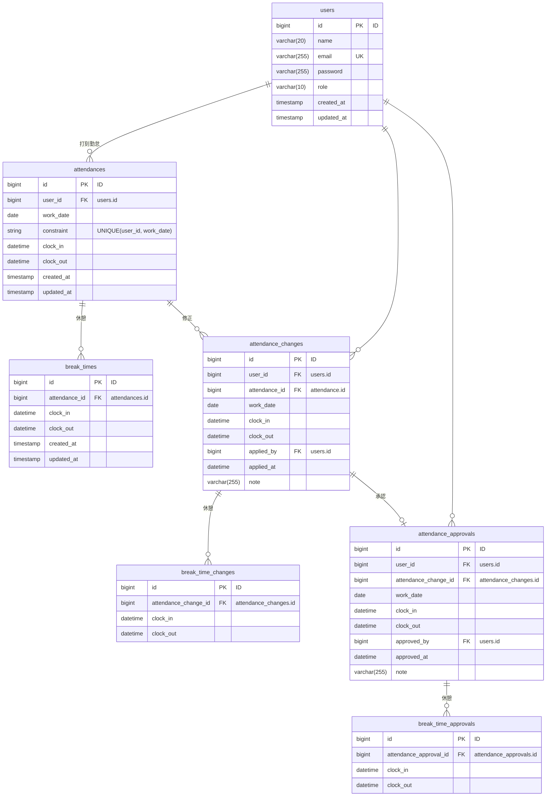

```mermaid

erDiagram
%%{init: {'theme': 'default'}}%%
    users ||--o{ attendances : "打刻勤怠"
    users ||--o{ attendance_changes : ""
    users ||--o{ attendance_approvals : ""

    users {
        bigint id PK "ID"
        varchar(20) name
        varchar(255) email UK
        varchar(255) password
        varchar(10) role
        timestamp created_at
        timestamp updated_at
    }

    attendances {
        bigint id PK "ID"
        bigint user_id FK "users.id"
        date work_date
        string constraint "UNIQUE(user_id, work_date)"
        datetime clock_in
        datetime clock_out
        timestamp created_at
        timestamp updated_at
    }

    attendances ||--o{ break_times : "休憩"

    break_times {
        bigint id PK "ID"
        bigint attendance_id FK "attendances.id"
        datetime clock_in
        datetime clock_out
        timestamp created_at
        timestamp updated_at
    }

    attendances ||--o{ attendance_changes : "修正"

    attendance_changes {
        bigint id PK "ID"
        bigint user_id FK "users.id"
        bigint attendance_id FK "attendance.id"
        date work_date
        datetime clock_in
        datetime clock_out
        bigint applied_by FK "users.id"
        datetime applied_at
        varchar(255) note
    }

     attendance_changes ||--o{ break_time_changes : "休憩"

    break_time_changes {
        bigint id PK "ID"
        bigint attendance_change_id FK "attendance_changes.id"
        datetime clock_in
        datetime clock_out
    }

    attendance_changes ||--o| attendance_approvals : "承認"

    attendance_approvals {
        bigint id PK "ID"
        bigint user_id FK "users.id"
        bigint attendance_change_id FK "attendance_changes.id"
        date work_date
        datetime clock_in
        datetime clock_out
        bigint approved_by FK "users.id"
        datetime approved_at
        varchar(255) note
    }

    attendance_approvals ||--o{ break_time_approvals : "休憩"

    break_time_approvals {
        bigint id PK "ID"
        bigint attendance_approval_id FK "attendance_approvals.id"
        datetime clock_in
        datetime clock_out
    }
```
